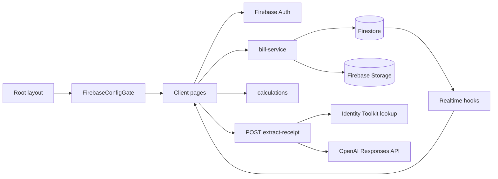

# โครงสร้างและ flow หน้าจอ

> ปรับปรุง 2026-09-05: อ่าน [ภาษาและ PWA — พฤติกรรมปัจจุบัน](LANGUAGE_AND_PWA.md) ประกอบ โดยหัวข้อภาษา, image decode, upload/extraction, Firebase hydration และ service worker ในบันทึกใหม่นี้แทนรายละเอียด baseline เดิม

อ้างอิง baseline `6a9558a` ณ 2026-09-05 ดู [สารบัญ](README.md)

## ขอบเขตระบบ

App Router อยู่ `app/` ไม่มี src หน้าธุรกิจเป็น client components ใช้ React state และ hooks โดยตรง ไม่มี Redux/Zustand หรือ auth context กลาง Root layout เป็น server component สำหรับ metadata และ Firebase bootstrap

ไม่มี REST CRUD บิล, Cloud Functions, payment gateway, ระบบเช็กการโอน หรือ remote push notification ใน source

## Routes

| URL | Source | หน้าที่ / สิทธิ์ใน UI |
| --- | --- | --- |
| `/` | `app/page.tsx` | Landing สำหรับ guest; user login แล้ว redirect dashboard |
| `/login` | `app/login/page.tsx` | Email/password; login แล้วไป dashboard; ไม่มี signup |
| `/dashboard` | `app/dashboard/page.tsx` | OwnerGuard, บิลตนเอง, create/delete, settings, sign out |
| `/bills/new` | `app/bills/new/page.tsx` | OwnerGuard, สร้าง draft อัตโนมัติแล้ว replace URL เป็น ?billId=... |
| `/bills/new?billId=...` | ไฟล์เดียวกัน | แก้ draft ที่เป็นของตน, upload, items, participants, share |
| `/bill/[billId]` | `app/bill/[billId]/page.tsx` | ห้อง realtime, guest ไม่ต้อง login |
| `/bill/[billId]/summary` | `app/bill/[billId]/summary/page.tsx` | ยอดและ QR เมื่อ completed/closed |
| `/settings` | `app/settings/page.tsx` | OwnerGuard, display name, QR, notification permission |
| `/api/extract-receipt` | `app/api/extract-receipt/route.ts` | POST multipart token + image → extraction |
| `/api/public-config` | `app/api/public-config/route.ts` | GET public Firebase config หรือ 503 |
| `/manifest.webmanifest` | `app/manifest.ts` | PWA metadata |
| `/icon`, `/apple-icon` | `app/icon.tsx`, `app/apple-icon.tsx` | PNG 32 / 180 จาก lib/pwa-icon.tsx |
| `/icons/[size]` | `app/icons/[size]/route.tsx` | size=512 ให้ 512px ค่าอื่นให้ 192px; await context.params |
| `/sw.js` | `public/sw.js` | Service worker สำหรับ local notifications ไม่มี fetch interception |

## เจ้าของสร้างบิล

1. `useAuth` รอ onAuthStateChanged และ merge users/{uid} ผ่าน ensureUserProfile; profile sync ล้มเหลวไม่ทำให้ login ล้มเหลว
2. Dashboard ฟัง useOwnerBills query ownerId เท่ากับ uid และ sort updatedAt ฝั่ง client
3. เข้า /bills/new แล้ว effect เรียก createDraftBill; cancelled flag ป้องกัน update UI หลัง unmount แต่ไม่ได้ยกเลิก write
4. Editor ฟัง useRealtimeBill ถ้า owner ไม่ตรงปฏิเสธใน UI ถ้าไม่ใช่ draft ให้เปิด room
5. ชื่อบิล, ชื่อ item, ราคา, qty, notes บันทึกตอน blur; notes แยกบรรทัดและตัดบรรทัดว่าง
6. Subtotal รวม price โดยตรง การแก้ qty ไม่เปลี่ยนราคา
7. เปลี่ยน split mode เรียก clearSelectionsForItem แล้ว updateBillItem คนละ commit
8. Upload แล้ว extract; items ที่อ่านได้แทนชุดเดิม อ่าน [Receipt](RECEIPT_EXTRACTION.md)
9. ปุ่ม start sharing ต้องมีอย่างน้อย 1 item และ 1 participant ใน UI; service ตั้ง active แล้วไป room
10. Share link ใช้ window.location.origin จึงเป็น origin ที่เปิดอยู่ รวมถึง tunnel ถ้าใช้ทดสอบ

## ห้องร่วม

- isOwner เทียบ user.uid กับ bill.ownerId; joinedId เป็นตัวตน participant ที่กำลังร่วมจ่าย คนละเรื่องกับ auth
- localStorage key `splitbill_participant_${billId}` เก็บชื่อที่เลือกโดย participant ID ไม่มีการยืนยันสิทธิ์ในชื่อนั้น
- Guest ที่ยังไม่มี joinedId เลือกชื่อที่มีอยู่หรือเพิ่มชื่อใหม่ด้วย addGuestParticipant
- Owner เลือกชื่อที่มีอยู่เพื่อร่วมจ่าย หรือจัดการบิลโดยไม่ร่วมจ่ายได้
- Draft: guest เห็น Not shared yet; owner เห็นลิงก์กลับ setup
- Active: shared/single กดการ์ดหรือ Enter/Space; quantity บันทึกตอน blur; ทุกคนเห็นยอด live และ progress
- I’m done สลับ Participant.isDone; ยังเลือก item หลัง done ได้ และไม่มี reset done อัตโนมัติ
- allDone ต้องมี participant อย่างน้อย 1 คนและทุกคน isDone ใช้ล็อกปุ่ม finalize และแจ้ง owner
- Completed/closed redirect summary ไม่มี UI เปิดกลับ active หรือ writer ตั้ง closed
- Owner เห็น chip ของทุก participant ต่อ item, copy link, delete, finalize

## Summary และ settings

Summary เรียก buildFinalSummary จากข้อมูล realtime แสดงยอดรายคน, จำนวนแถว share > 0, group total และ bill.ownerPaymentQrUrl ถ้ายังไม่ finalize แสดงลิงก์กลับ room ไม่มี payment status หรือยืนยันการโอน

Settings เรียก getUserProfile เมื่อเข้าและหลังบันทึก ไม่มี realtime profile listener Display name เก็บไว้แต่ยังไม่แสดงต่อ guest QR เป็นรูปธนาคาร/PromptPay ที่อัปโหลดเอง ไม่ได้ generate จากยอดจ่าย

## Shared UI

| Source | หน้าที่ |
| --- | --- |
| `components/AppShell.tsx` | Header, title, action, home link, mobile column max-w-lg |
| `components/OwnerGuard.tsx` | รอ auth / redirect login ตรวจเพียงมี user ไม่ตรวจ role claim |
| `components/FirebaseConfigGate.tsx` | รอ config ก่อน mount children ที่ใช้ Firebase |
| `components/LoadingScreen.tsx` | Spinner, message, hint |
| `components/DeleteBillButton.tsx` | Native confirm, busy/error, delete แล้วกลับ dashboard เป็นค่าเริ่มต้น |
| `components/TunnelHint.tsx` | ตรวจ hostname tunnel และแสดงคำแนะนำ |
| `components/PwaRegister.tsx` | Register /sw.js และ ignore error |
| `app/globals.css` | Tailwind import, system fonts, CSS variables, dark mode ตาม OS |

UI รองรับไทย/อังกฤษผ่าน LanguageProvider และฟอนต์ Google Noto Sans Thai Looped แบบ self-hosted; receipt รองรับไทย เงิน format th-TH / THB ที่ lib/currency.ts ใช้ Tailwind ในแต่ละหน้า ยังไม่มี form/button design system กลาง

## Notification และ PWA

lib/notify.ts ใช้ browser Notification permission และ service worker showNotification โดย fallback new Notification เมื่อเส้นทางแรก reject Room เป็นผู้เรียกเมื่อ owner เปิด active bill และทุกคน done

กันซ้ำด้วย sessionStorage key `splitbill_all_done_notified_${billId}` ล้างเมื่อมีคนไม่ done ค่า notifyEnabled ใน profile บันทึกจาก settings แต่ room ยังไม่อ่านเพื่อควบคุม notification

Service worker ไม่มี cache/offline queue หรือ push subscription; notification click focus หน้าต่างแรก หรือเปิด / ไม่ deep link กลับบิล ต้องมี client room ที่ยังทำงานอยู่ Manifest standalone, portrait, start /; ไอคอนเหรียญ SB สร้างด้วย ImageResponse และมี app/favicon.ico แยกอยู่ด้วย
